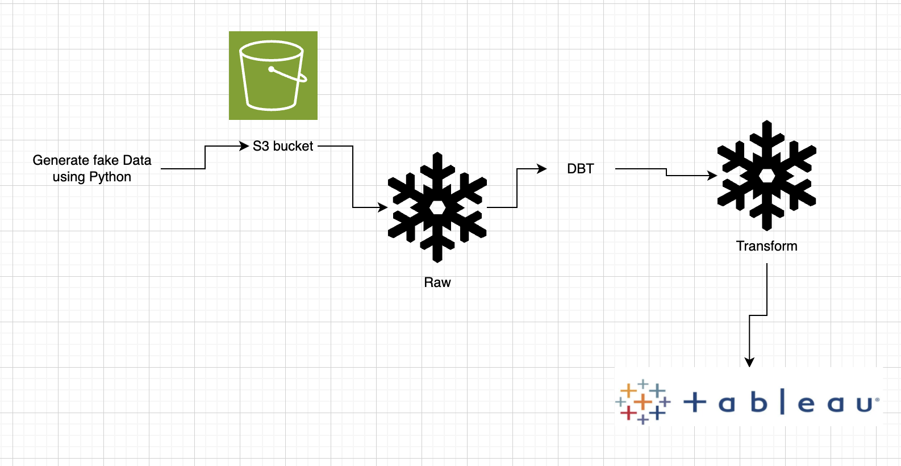

# 🚀 ETL Pipeline with Snowflake

This repository provides a comprehensive guide and implementation of an **ETL (Extract, Transform, Load)** pipeline using **Snowflake** as the data warehousing solution. The project demonstrates how to **generate synthetic data programmatically**, transform it into a usable format, and load it into Snowflake for analytics and reporting purposes. Additionally, it integrates **Amazon S3** for data storage, **dbt (Data Build Tool)** for advanced data transformations, and **Tableau** for visualization and reporting.

---

## 🌟 Overview

The ETL pipeline is a critical component of modern data engineering workflows. In this project, instead of extracting data from external sources, **synthetic data is generated using Python** and uploaded to **Amazon S3**. From there, the data is transformed using **dbt**, loaded into **Snowflake**, and visualized using **Tableau**.



---

## 🎯 Key Features

- **🧑‍💻 Synthetic Data Generation**: Programmatically generate realistic order data using Python and the `Faker` library.
- **📦 Data Storage**: Upload generated data to **Amazon S3** for scalable and reliable storage.
- **🛠️ Data Transformation**: Clean, enrich, and transform raw data using **dbt** for modular and maintainable SQL-based transformations.
- **📤 Data Loading**: Load processed data into **Snowflake** for storage and querying.
- **📊 Visualization**: Connect **Snowflake** to **Tableau** for creating interactive dashboards and reports.
- **📈 Scalability**: Utilize **Snowflake's** elastic compute resources and **S3's** scalable storage to handle large datasets efficiently.

---

## 🛠️ Technologies Used

- **❄️ Snowflake**: Cloud-based data warehousing platform.
- **📦 Amazon S3**: Scalable object storage for raw and intermediate data.
- **🔧 dbt (Data Build Tool)**: For SQL-based data transformations and modeling.
- **📊 Tableau**: For data visualization and business intelligence.
- **🐍 Python**: For generating synthetic data and scripting ETL processes.
- **📜 SQL**: For querying and managing data within Snowflake and dbt.

---

## 🚀 Getting Started

### 📋 Prerequisites

- A **Snowflake** account with necessary permissions.
- An **AWS account** with access to **S3**.
- **Python 3.x** installed.
- **dbt** installed (`pip install dbt-core dbt-snowflake`).
- **Tableau Desktop** or **Tableau Server** for visualization.

🛠️ Usage
🧑‍💻 Synthetic Data Generation:

Run laod_s3.ipynb to generate synthetic order data and upload it to an S3 bucket.

❄️ Create Snowflake Table:

Execute the following SQL in Snowflake to create the ORDERS table:
```
CREATE OR REPLACE TRANSIENT TABLE DBT_DEMO.BASE.ORDERS (
    ORDERID VARCHAR(16777216),
    CUSTOMERID VARCHAR(16777216),
    ORDERDATE VARCHAR(16777216),
    ORDERSTATUS VARCHAR(16777216),
    COUNTRY VARCHAR(16777216),
    PRODUCTID VARCHAR(16777216),
    QUANTITYORDERED NUMBER(38,0),
    PRICE NUMBER(38,0),
    TOTALAMOUNT FLOAT,
    CHANGETIME TIMESTAMP_NTZ(9),
    BATCH_ID VARCHAR(36)
);
```


📤 Load Data from S3 to Snowflake:

Create a stage in Snowflake to connect to the S3 bucket:
```
CREATE OR REPLACE STAGE my_s3_stage
    URL = 's3://harrytestz/orders/'
    CREDENTIALS = (
        AWS_KEY_ID = 'YOUR_AWS_KEY_ID',
        AWS_SECRET_KEY = 'YOUR_AWS_SECRET_KEY'
    )
    FILE_FORMAT = (TYPE = CSV);
```
Load data from S3 into the ORDERS table:
```
COPY INTO dbt_demo.staging.orders
FROM @dbt_demo.staging.my_s3_stage/fake_cdc_order_data_2.csv
    FILE_FORMAT = (
        TYPE ='CSV'
        SKIP_HEADER=1
    );
```

🛠️ Data Transformation:

Use dbt to transform the data. Navigate to the dbt/ directory and run:
```
dbt run
```
📊 Visualization:

Connect Tableau to Snowflake and create dashboards using the processed data.


## 🔄 Workflow Overview

🧑‍💻 Generate Data: Synthetic order data is generated using Python and uploaded to S3.

🛠️ Transform: dbt is used to transform the raw data into structured datasets within Snowflake.

📤 Load: Transformed data is loaded into Snowflake tables for analysis.

📊 Visualize: Tableau connects to Snowflake to create interactive dashboards and reports.

